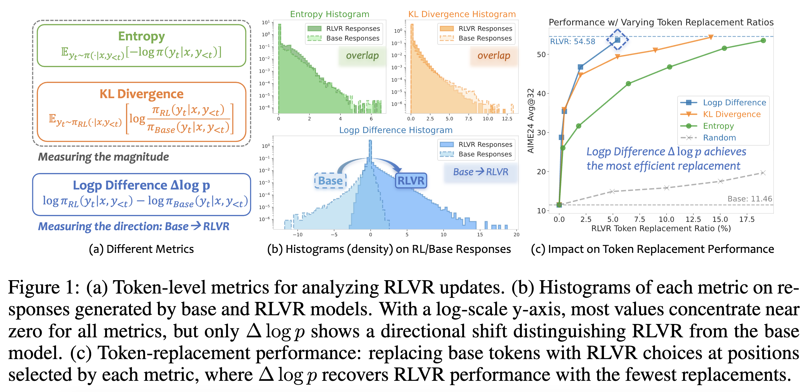
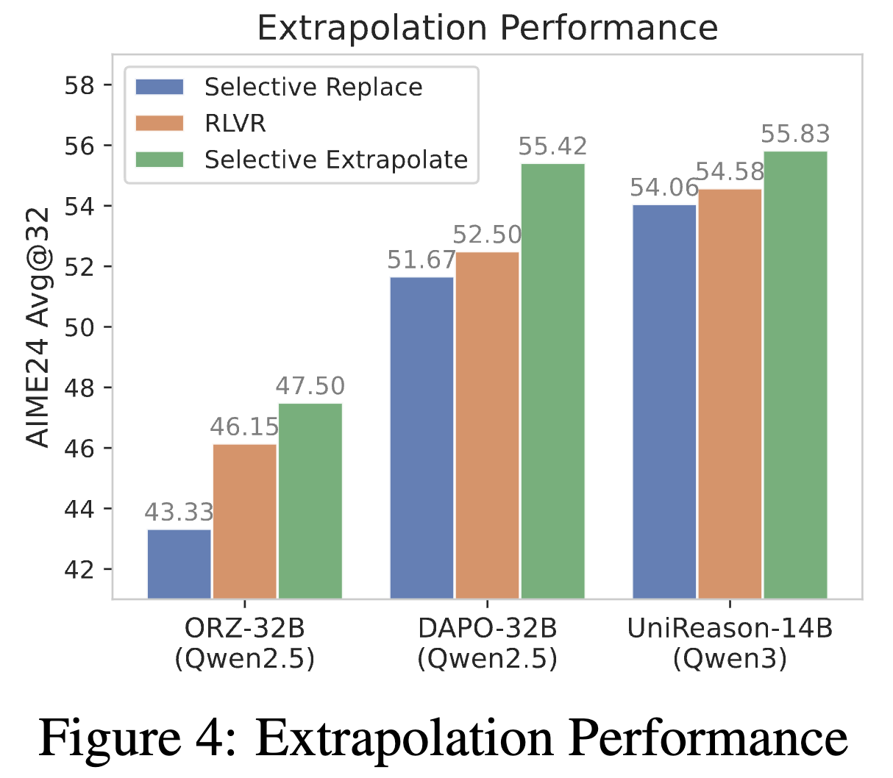
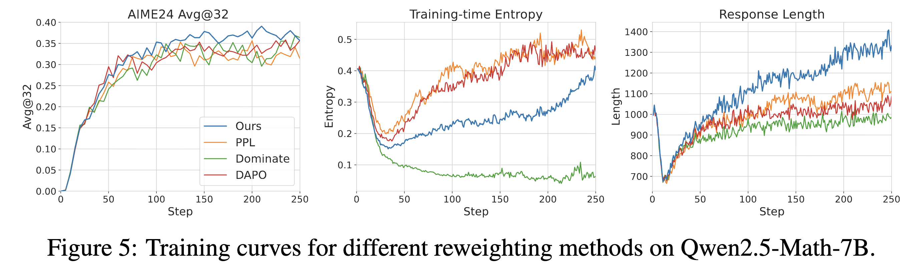
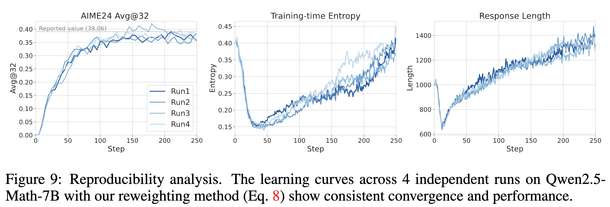

# RLVR Directions
> Source code for our ICLR'26 paper: [Beyond Magnitude: Leveraging Direction of RLVR Updates for LLM Reasoning](https://openreview.net/forum?id=r6Pw3RiMYL)

## 🔍 Token Replacement & Extrapolation

### Usage

The extrapolatation codes are located in the `extrapolate` folder.
We generate 32 responses for each prompt, with 8 different random seeds and 4 responses per seed, the script can be found in `scripts/run_extrapolate.sh`.

The results will be saved in the `extrapolate/results` folder, which can be checked using the `check_results.ipynb` notebook.

### Empirical Results

We conduct token replacement (adapted from [Meng et al.](https://openreview.net/forum?id=8vWIXno8LW)) to compare the effectiveness of different metrics in identifying critical tokens. We then apply extrapolation with $\Delta\log p$ to amplify RLVR-induced changes.

<div align="center">
  
  
  <p><em>Left: Token Replacement w/ Different Metrics. Right: Extrapolation w/ Δlogp.</em></p>
</div>


## 🚀 RL Training w/ Reweighting

### Usage

Our RL training implementation is built upon the [`verl`](https://github.com/volcengine/verl) library. The modified DAPO recipe is available in `verl/recipe/logp_rl/`.

1. **Preparation**: Follow the [DAPO recipe](https://github.com/BytedTsinghua-SIA/DAPO) to prepare your datasets and models.
2. **Training**: Execute the corresponding script for your model:
   - For **Qwen2.5-Math-7B**: `bash scripts/run_7B.sh`
   - For **Qwen3-8B-Base**: `bash scripts/run_8B.sh`

### Empirical Results

The training curves for Qwen2.5-Math-7B across different reweighting methods demonstrate the superiority of our approach:

<div align="center">
  
</div>

For reproducibility, we performed 4 independent runs of our method. All runs consistently reached or exceeded the reported performance:

<div align="center">
  
</div>


## 📖 Reference
If you find our work helpful, please consider citing it:
```Bibtex
@inproceedings{
  huang2026on,
  title={Beyond Magnitude: Leveraging Direction of RLVR Updates for LLM Reasoning},
  author={Kexin Huang and Haoming Meng and Junkang Wu and Jinda Lu and Chiyu Ma and Ziqian Chen and Xue Wang and Bolin Ding and Jiancan Wu and Xiang Wang and Xiangnan He and Guoyin Wang and Jingren Zhou},
  booktitle={The Fourteenth International Conference on Learning Representations},
  year={2026},
  url={https://openreview.net/forum?id=r6Pw3RiMYL}
}
```
